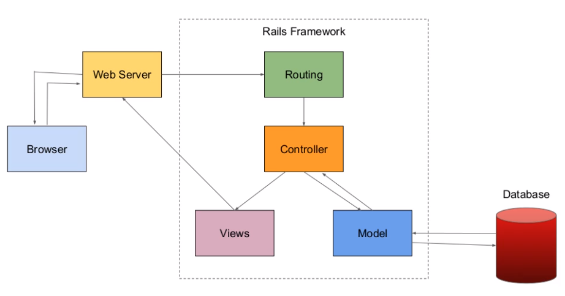
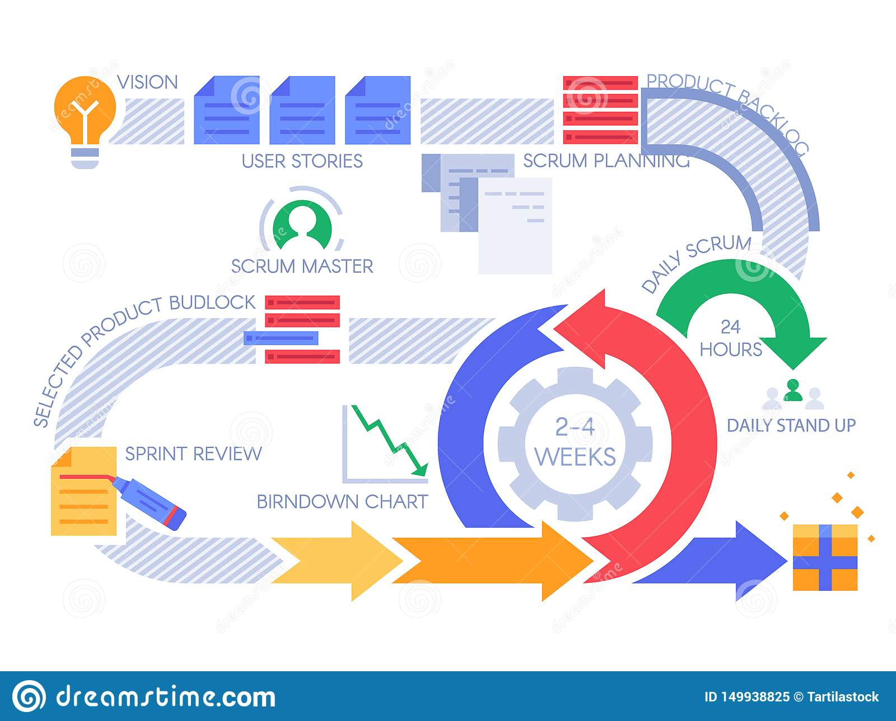

## Q1 - Describe the architecture of a typical Rails application

The architecture of a typical Rails app is best shown and then explained:

### BRIEF EXPLANATION:

* Browser: Sends requests to the web server, receives information (HTML file) from the web server based on request and displays it to the user 

* Web Server: sends requests it receives to the routing engine. Receives HTML files and sends them to the browser

* Routing: sends request to the appropriate controller based on the routing URL pattern of the request  

* Controller: receives request, renders a view and/or interacts with the model depending on the type of request  

* model: when invoked by the controller will interact with the database and if required retrieve data for the controller  

* View: constructs a html document to be served to a browser that contains the requested data  

### LIFE OF A REQUEST IN RAILS ARCHITECTURE:

1. User makes a request from their browser, browser makes a request to a web server (that request can be any of the following methods: GET, HEAD, POST, PUT, DELETE, CONNECT, OPTIONS, TRACE

2. The web server then sends that request to the appropriate routing engine

3. The route engine then sends that request to the appropriate controller based on the routing URL pattern of the request  

4. The controller receives the request from the routing engine and calls upon its appropriate method, it may immediately display a view or interact with the model (this depends on type of request received)

5. If the model is invoked, it will interact with the database and perform operations outlined in the controllers method

6. After invoking the model, the controller may then call upon another of its appropriate methods or choose to render a view. When rendering a view, the controller may request data from the model and then send that data to the view while rendering it. (no data needs to be necessarily sent for a view to be rendered)

7. when the view is rendered, it receives any data sent by the controller. The view than sends a HTML file back to the web server, this HTML file can either be a dynamically generated HTML file (from the data sent over by the controller) or a static file.

8. The web server receives the HTML file and sends it to the browser 

9. Browser receives HTML file and displays it to the user 

REFERENCES:

https://www.tutorialspoint.com/http/http_methods.htm
https://www.bogotobogo.com/RubyOnRails/RubyOnRails_Model_View_Controller_MVC.php

---

## Q2 - Identify a database management system (DBMS) commonly used in web applications (including Rails) and discuss the pros and cons of this database

A database management system commonly used in web applications including rails is PostgreSQL also known as Postgres. PostgreSQL was released in 1996, influenced by the Ingres DBMS, it is a free and open source DBMS used world wide in a variety of applications.

PRO:

* PostgreSQL is free meaning anyone can use it for whatever purpose they desire without cost, this means anyone can start a project that requires a DBMS with little to no startup costs, for a startup company this reduces the risk on their investment.

* PostgreSQL is open-source meaning anyone has access to the code, it is maintained and examined by a large amount of people, new features can be added by anyone and constant improvements are being made.

* PostgreSQL is multiplatform, it can be used on Windows, mac and linux.

CON:

* lacks In-memory capabilities. In-memory databases are faster than disk-optimized databases because disk access is slower than memory access, the internal optimization algorithms are simpler and execute fewer CPU instructions

* No official support as it is open source. If you went with a commercial DBMS you would have access to a tech department that could guide you through issues related to the DBMS. If you were having issues with PostgreSQL in your commercial application you would have to find your solutions in forums where you're not guaranteed an answer, support or a timely response, for a commercial product this could be a costly issue.

* Popularity, PostgresSQL popularity has dropped in recent years making it that much harder to effectively use and implement. 

REFERENCES:

https://en.wikipedia.org/wiki/PostgreSQL  
https://www.trustradius.com/products/postgresql/reviews  
https://en.wikipedia.org/wiki/In-memory_database
https://www.capterra.com/p/48791/PostgreSQL/reviews/

---

## Q3 - Discuss the implementation of Agile project management methodology

1. VISION:  
Discuss with your team the goal of your project, what needs are you trying to meet, problems you're attempting to solve? define the mission of your project. 

2. USER STORIES:  
Define user stories for your project, these stories make up the collection of your product backlog (wishlist of features for your product) from these you will develop the features of your product.

3. SCRUM PLANNING:  
Plan out the features you wish to implement for your next release based on your product backlog. Prioritize the features to implement and estimate the time involved to complete each feature. Larger user stories are broken down into more manageable chunks.

4. SPRINT:  
Divide each feature into a sprint to be completed. The sprint duration is set to the release schedule. Each sprint is tracked by a burndown chart to make sure the sprint is on schedule for the next release. When the burndown chart indicates that the project isn't on schedule, the project can be examined and adjusted so its put back on track.

5. DAILY STAND UP:  
Everyday before work commences a stand up takes place. The goal of the stand up is to convey what work was completed since the last stand up, what the plan is for the day and any issues that are getting in the way.

6. SPRINT REVIEW:  
Once a sprint is completed the team will conduct a review. The review will go over what went right in the sprint, what went wrong and what needs improving.

7. RELEASE:  
Once all assigned sprints are completed, the next product release can be issued and the process can begin again from the scrum planning stage until the products final release.

REFERENCES:

https://searchcio.techtarget.com/definition/Agile-project-management
https://plan.io/blog/ultimate-guide-to-implementing-agile-project-management-and-scrum/  
Agile Project Management Tutorial: https://www.youtube.com/watch?v=thsFsPnUHRA  
Intro to Scrum in Under 10 Minutes: https://www.youtube.com/watch?v=XU0llRltyFM

---

## Q4 - Provide an overview and description of a standard source control workflow 100-200

REFERENCES:

---

