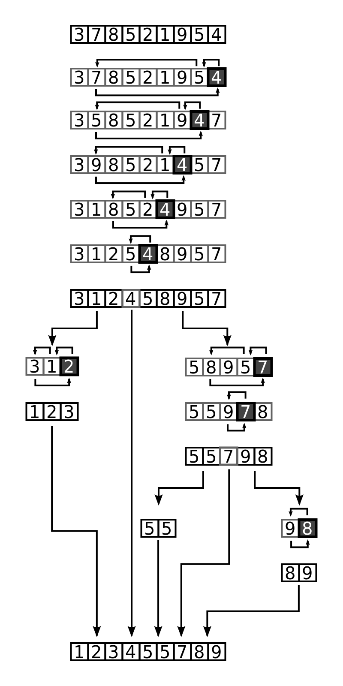
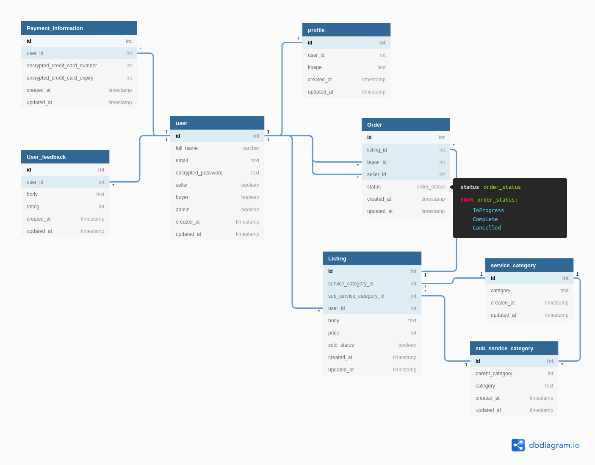

# JAKE GLASSON - T2A1 WORKBOOK

### BRIEF:

ACME Corporation is looking for devs with an understanding of Rails. The following set of questions relate to this RFQ-requirement.

## Q1 - Describe the architecture of a typical Rails application

The architecture of a typical Rails app is best shown and then explained:


### BRIEF EXPLANATION:

* Browser: Sends requests to the web server, receives information (HTML file) from the webserver based on request and displays it to the user

* Web Server: sends requests it receives to the routing engine. Receives HTML files and sends them to the browser

* Routing: sends a request to the appropriate controller based on the routing URL pattern of the request

* Controller: receives a request, renders a view and/or interacts with the model depending on the type of request

* model: when invoked by the controller will interact with the database and if required retrieve data for the controller

* View: constructs a HTML document to be served to a browser that contains the requested data

### LIFE OF A REQUEST IN RAILS ARCHITECTURE:

1. A user submits a request from their browser, the browser makes a request to a web server (that request can be any of the following methods: GET, HEAD, POST, PUT, DELETE, CONNECT, OPTIONS, TRACE)

2. The web server then sends that request to the appropriate routing engine

3. The routing engine then sends that request to the appropriate controller based on the routing URL pattern of the request

4. The controller receives the request from the routing engine and calls upon its appropriate method, it may immediately display a view or interact with the model (this depends on the type of request received)

5. If the model is invoked, it will interact with the database and perform operations outlined in the controller's method

6. After invoking the model, the controller may then call upon another of its appropriate methods or choose to render a view. When rendering a view, the controller may request data from the model and then send that data to the view while rendering it. (no data needs to be necessarily sent for a view to be rendered)

7. When the view is rendered, it receives any data sent by the controller. The view then sends a HTML file back to the web server, this HTML file can either be a dynamically generated HTML file (from the data sent over by the controller) or a static file.

8. The web server receives the HTML file and sends it to the browser

9. The browser receives the HTML file and displays it to the user

REFERENCES:

https://www.tutorialspoint.com/http/http_methods.htm
https://www.bogotobogo.com/RubyOnRails/RubyOnRails_Model_View_Controller_MVC.php

---

## Q2 - Identify a database management system (DBMS) commonly used in web applications (including Rails) and discuss the pros and cons of this database

A database management system commonly used in web applications including rails is PostgreSQL also known as Postgres. PostgreSQL was released in 1996, influenced by the Ingres DBMS, it is a free and open-source DBMS used worldwide in a variety of applications.

PRO:

* PostgreSQL is free meaning anyone can use it for whatever purpose they desire without cost, this means anyone can start a project that requires a DBMS with little to no startup costs, for a startup company this reduces the risk on their investment.

* PostgreSQL is open-source meaning anyone has access to the code, it is maintained and examined by a large number of people, new features can be added by anyone and constant improvements are being made.

* PostgreSQL is multiplatform, it can be used on Windows, Mac, and Linux.

CON:

* lacks In-memory capabilities. In-memory databases are faster than disk-optimized databases because disk access is slower than memory access, the internal optimization algorithms are simpler and execute fewer CPU instructions

* No official support as it is open source. If you went with a commercial DBMS you would have access to a tech department that could guide you through issues related to the DBMS. If you were having issues with PostgreSQL in your commercial application you would have to find your solutions in forums where you're not guaranteed an answer, support, or timely response, for a commercial product this could be a costly issue.

* Popularity, PostgresSQL popularity has dropped in recent years making it that much harder to effectively use and implement.

REFERENCES:

https://en.wikipedia.org/wiki/PostgreSQL
https://www.trustradius.com/products/postgresql/reviews
https://en.wikipedia.org/wiki/In-memory_database
https://www.capterra.com/p/48791/PostgreSQL/reviews/

---
### BRIEF:

ACME Corporation is very big on project management, documentation, and process. This will be a key metric in their decision to award the project. The following set of questions relate to this RFQ-requirement.

## Q3 - Discuss the implementation of Agile project management methodology


1. VISION:
Discuss with your team the goal of your project, what needs are you trying to meet, problems you're attempting to solve? define the mission of your project.

2. USER STORIES:
Define user stories for your project, these stories make up the collection of your product backlog (wishlist of features for your product) from these you will develop the features of your product.

3. SCRUM PLANNING:
Plan out the features you wish to implement for your next release based on your product backlog. Prioritize the features to implement and estimate the time involved to complete each feature. Larger user stories are broken down into more manageable chunks.

4. SPRINT:
Divide each feature into a sprint to be completed. The sprint duration is set to the release schedule. Each sprint is tracked by a burndown chart to make sure the sprint is on schedule for the next release. When the burndown chart indicates that the project isn't on schedule, the project can be examined and adjusted so it is put back on track.

5. DAILY STAND UP:
Every day before work commences a stand up takes place. The goal of the stand up is to convey what work was completed since the last stand up, what the plan is for the day, and any issues that are getting in the way.

6. SPRINT REVIEW:
Once a sprint is completed the team will conduct a review. The review will go over what went right in the sprint, what went wrong, and what needs improving.

7. RELEASE:
Once all assigned sprints are completed, the next product release can be issued and the process can begin again from the scrum planning stage until the products final release.

REFERENCES:

https://searchcio.techtarget.com/definition/Agile-project-management
https://plan.io/blog/ultimate-guide-to-implementing-agile-project-management-and-scrum/
Agile Project Management Tutorial: https://www.youtube.com/watch?v=thsFsPnUHRA
Intro to Scrum in Under 10 Minutes: https://www.youtube.com/watch?v=XU0llRltyFM

---

## Q4 - Provide an overview and description of a standard source control workflow

A standard source control that is widely used is Git. Git allows you to effectively take snapshots of your projects as you develop them, this allows teams to keep a record of changes to the project which can be rolled back to a previous snapshot if any issues arise, it allows a team to collaboratively work on a project without worrying about conflicting code.

The workflow of using Git is as such:

* You create a new folder for that project

* Inside that new folder you would initialize Git, you are no on the master branch

* From here you can start to design your project

* When working on a new feature for the project you would open a new branch and call that branch something relating to the feature you're developing

* As you develop aspects of your feature you make meaningful commits, snapshots of your feature, that way you can roll back if something doesn't go right

* Once you've completed your feature you would merge it with the master branch

* Git has inbuilt conflict detection so any issues with merging files will be highlighted and halt the merging process until they are fixed

* If you experience problems with your project you open the log, note your previous commits and rollback to them

That is the workflow of the standard source control Git.

## Q5 - Provide an overview and description of a standard software testing process (e.g. manual testing)

### SYSTEM TESTING:

System testing is the process of testing the finished product.

During the process of designing software, the software must pass through unit testing (where each component is tested separately) and integration testing (where components are combined and tested together). Once these tests are complete all components are combined into the final product for system testing.

The purpose of system testing is to ensure that the finished product meets the specified requirements.

For an example of System Testing, we will take a look at a very brief overview of how it applies to a car being manufactured.

Each component of the car is designed separately and tested (unit testing).

Key components are combined and tested together (integration testing) like the engine and driveshaft.

After these tests are passed the production moves into System Testing.

From here the car is fully assembled and put through rigorous testing designed to find if the combined components produce unexpected results and if they meet specified requirements.

If the finished car does not meet requirements or produces undesirable results, the car is disassembled and components are reexamined as well as ran through the testing process again until the finished car meets requirements and produces no unexpected results.

REFERENCES:

https://smartbear.com/learn/automated-testing/software-testing-methodologies/

---

### BRIEF:
Having suffered several cyber attacks in the past and resultant remedial audits ACME Corporation takes compliance, security, and privacy very seriously. The following set of questions relate to this RFQ-requirement.


## Q6 - Discuss and analyze requirements related to information system security and how they relate to the project

Information system security is the process and methods involved with keeping information secure, confidential, available, and ensuring its integrity.

Requirements:

* Confidentiality: Information is kept available only to those individuals who have the authority to access it.

* Integrity: Maintain and assure the accuracy and completeness of the data over its lifetime.

* Availability: Information must be readily available for when it is needed. This means that all systems in place pertaining to that information (computer systems used to store and process it, security protocols and communication channels the information flows through) are working correctly

Concerning the ACME project what this means is that all data relating to the project needs to be analyzed to determine what needs to be kept confidential and who has access to this data.

The integrity of the project data must be maintained at all times, records and backups are to be kept and stored securely with access limited to only those who are authorized.

The availability of the project data must not be compromised. All systems in place (computer systems, security protocols, and communication channels) need to be flowing smoothly so that access to the data isn't impeded preventing work from being done.

REFERENCES:

https://www.techopedia.com/definition/24840/information-systems-security-infosec
https://en.wikipedia.org/wiki/Information_security

---

## Q7 - Discuss common methods of protecting information and data and how you would apply them to the project

### Risk Assessments:

Data is analyzed to determine how much security is needed for certain types of data.

#### Applying risk assessments to the project:

* Data will be analyzed and from this, different levels of security will be enacted for each data based on the potential severity of it being leaked and the probability of a leak happening.

* The use of different levels of security will lower overall costs for the project.

* The risk management will be conducted by an outside party (data protection officer).

### Backups:

Backups are needed to prevent loss of data in the case of user error or technical malfunction.

#### Applying backups to the project:

* Backups are to be made as well as updated regularly.

* Data is backed up in terms of importance, highly important data is backed up often while less important data is backed up less frequently.

* Backups are to be stored in a safe and secure location.

* Backups are to be encrypted.

* Never store sensitive data backups in the cloud.

* Check backup storage media often for deterioration, replacing backups that may fail due to physical failures. Store the physical backups as per official recommendations.

REFERENCES:

https://gdprinformer.com/gdpr-articles/6-essential-data-protection-methods

---

## Q8 - Research what your legal obligations are in relation to handling user data and how they can be met for the project

All privacy principles are derived from the Australian Privacy Act of 1988.

https://www.legislation.gov.au/Series/C2004A03712

#### Australia Privacy Principles (APP):

During the project and all other business dealings, ACME must adhere to all APP. The following are three out of the thirteen principles.

#### Open and transparent management of personal information:

* Manage personal information openly and transparently

* Maintain an up to date APP privacy policy and have it easily accessible, free of charge

Concerning the project, all information is to be gathered openly and transparently while maintaining an APP privacy policy in accordance with the outlined regulations. The APP privacy policy is to be made freely accessible on the project website / ACME website.

https://www.oaic.gov.au/privacy/australian-privacy-principles-guidelines/chapter-1-app-1-open-and-transparent-management-of-personal-information/

#### Anonymity and pseudonymity:

* Provide the option for individuals to NOT identify themselves or the ability to use a pseudonym.

Concerning the project, while gathering information on individuals, ACME must allow individuals to remain anonymous or use a pseudonym to identify themselves if that individual should choose to do so.

https://www.oaic.gov.au/privacy/australian-privacy-principles-guidelines/chapter-2-app-2-anonymity-and-pseudonymity/

#### Collection of solicited personal information:

* Only collect personal information that is reasonably necessary or directly related to the activities or functions of ACME

* Only collect information if the individual consents to their information being collected

* Only collect information through lawful and fair means as well as directly from the individual

Concerning the project, ACME must only collect information that is pertinent to the project. Only collect that information if the individual consents as well as only collecting it through lawful, fair means and directly from the individual.

https://www.oaic.gov.au/privacy/australian-privacy-principles-guidelines/chapter-3-app-3-collection-of-solicited-personal-information/

REFERENCES:

https://www.oaic.gov.au/privacy/australian-privacy-principles/

---

### BRIEF:

ACME Corporation has specifically requested the app to be based on a relational database. The next set of questions relate to this RFQ-requirement.

## Q9 - Describe the structural aspects of the relational database model. Your description should include information about the structure in which data is stored and how relations are represented in that structure. 100-200

The structural aspects of a database are such that data is stored in tables, these tables consist of columns as well as rows and for some tables, relationships exist between them.

#### Table structure:

Each row in a table consists of entries that contain data that relate to one another, e.g. an entry on a person may contain their name, age, height, gender, etc.

Each column holds certain data pertaining to a particular aspect of an entry, in the case of the above example one column may hold all the values for the age of every entry while another contains the heights and so on.

#### Relationships:

One-to-one:

* In a user database (e.g. Facebook) you would have two tables, one that contains a list of users and the other a list of their emails. Each user has one email and vice versa, therefore the relationship between these two tables is said to be one-to-one.

One-to-many/many-to-one:

* In a citizen database you would have a table for each citizen and a table for their addresses. An address may have many citizens that reside there while a citizen has one address, thus the relationship between a person and an address is called one-to-many/many-to-one.

Many-to-many:

* In a library database you may have a table for all your books and a table for all your authors. The relationship between a book and an author is that a book may have many authors and an author also may have many books, this relationship is called many-to-many.

REFERENCES:

https://support.airtable.com/hc/en-us/articles/218734758-A-beginner-s-guide-to-many-to-many-relationships

---

## Q10 - Describe the integrity aspects of the relational database model. Your description should include information about the types of data integrity and how they can be enforced in a relational database. 100-200

Data integrity refers to the maintenance of data as well as the overall completeness, accuracy, and consistency of that data stored in the database. Data integrity is maintained through the use of various error-checking methods and validation procedures. The goal of data integrity is to prevent unintentional as well as unwanted changes to data.

#### Types of data integrity:

Entity Integrity:

* All tables must have a primary key. The values within the column chosen to be the primary key must be unique and cannot be null/nil.

* This can be enforced by requiring (inside the schema) the primary key to have an integer value that cannot be null/nil.

Referential Integrity:

* All foreign keys can be in only one of two states. Either referencing another table entry or not referencing anything (null/nil).

* This can be enforced by requiring (inside the schema) the referenced key to have only an integer value or null/nil. At the time of entry, the reference key value should be checked in the table its referencing to ensure the entry exists, if the reference doesn't exist then the data is not saved.

Domain Integrity:

* All data entered into columns must fit with a domain of parameters outlined for the column to which the data is input.

* This can be enforced in the schema by giving a column set parameters and when a value is entered outside of those parameters the entry is not saved.

REFERENCES:

https://www.techopedia.com/definition/811/data-integrity-databases
https://en.wikipedia.org/wiki/Data_integrity

---

## Q11 - Describe the manipulative aspects of the relational database model. Your description should include information about the ways in which data is manipulated (added, removed, changed, and retrieved) in a relational database.

Data is manipulated in a relational database through SQL commands. The commands that are used are the following:

### SELECT:

The SELECT statement is used to query or extract data from tables inside of a database, this is how data is retrieved from a database.

Using SELECT on a given table, you can retrieve all data from all columns or specific data from predefined columns (dependent on what is specified for the SELECT query).

Example syntax:

```
SELECT column_list FROM table-name
```

Example:

```
SELECT street_address FROM census_data;
```

### UPDATE:

The UPDATE statement is used to update/modify data within existing rows in a given table, this is how data is changed within a database.

When using the UPDATE statement, the WHERE clause must be used otherwise all specified columns of data within the table will be changed.

Example syntax:

```
UPDATE table_name
SET column_name = value,
column_name2 = value, ...
[WHERE condition]
```

Example:

```
UPDATE address
SET street ='3 fake st'
WHERE id = 7;
```


### DELETE:

The DELETE statement is used to delete existing rows within a given table, this is how data is removed from a database.

When using the DELETE statement, the WHERE clause must be used otherwise all rows within the table will be deleted.

Example syntax:

```
DELETE FROM table_name [WHERE condition];
```

Example:

```
DELETE FROM student WHERE id = 50;
```

INSERT INTO:

The INSERT INTO statement is used to add new data entries (rows) into a given table, this is how new data is added to a database.

When adding data to specific columns, those columns must be specified.

When adding data to all columns then the columns don't need to be specified.

Example syntax:

```
INSERT INTO TABLE_NAME
[ (col1, col2, col3,...colN)]
VALUES (value1, value2, value3,...valueN);
```

Example:

```
INSERT INTO student (id, first_name, last_name, age, grade)
VALUES (72, 'John', 'Doe', 12, 7);
```

REFERENCES:

https://beginner-sql-tutorial.com/sql-commands.htm

---

### BRIEF:

The efficiency of an app (i.e. site) and the algorithms used are of the utmost importance. The next set of questions relate to this RFQ-requirement.

## Q12 - Identify and explain the workings of TWO sorting algorithms and discuss and compare their performance/efficiency (i.e. Big O)

### QUICK SORT:

Quick sort is a divide-and-conquer algorithm. Quick sort works by selecting a random point (the pivot) from its input array and partitioning the elements either side of that pivot into two separate arrays.

The separate arrays are as follows: one for the elements that are greater than the point selected and one for the elements that are less than the point selected.

These new arrays are then sorted recursively (The Quick sort method is applied to these arrays as well) until no more elements can be sorted and then joined together.

Once this process is complete we are left with the final sorted array.

The following is a diagram from Wikipedia showing the quick sort process:



### MERGE SORT:

Merge sort is a divide-and-conquer algorithm. Merge sort works by splitting its input array in half, recursively calling its split function on the two halves created until we are left with only single elements.

These split halves are then sorted and merged until we are left with a single, sorted array.

The following is a diagram from Wikipedia showing the merge sort process:


### QUICKSORT VS MERGESORT COMPARISON:

| | QUICKSORT VS MERGESORT |
|-------------------------	|------------------------------------------------------------------------------------------------------------------------------------------------------------------------------------------------	|
| SPEED | Quick sort has a speed/run-time of O(log n) in a best-case/average scenario and O(n2) in worst-case scenarios dependent on its implementation |
| | Merge sort has a guaranteed speed/run-time of O(nlogn) no matter the randomness of the starting list |
| | On average merge sort is faster than quick sort on an average and worst-case scenario |
| ELEMENT COMPARISONS | Merge sort performs fewer comparisons compared to quick sort contributing to its on average faster speed than quick sort |
| MEMORY USAGE | Quick sort uses less memory than merge sort, therefore if you don't have a lot of memory (RAM) available to dedicate to a sorting algorithm than quick sort is a better choice over Merge sort |
| REAL WOLRD APPLICATIONS | Quick sort should be used over merge sort in most real-world scenarios due to Quick sorts lower memory consumption which is a contributing factor to performance |
| | Merge sort should only be used in real-world scenarios where time is critical and large amounts of memory are available |

REFERENCES:

https://en.wikipedia.org/wiki/Quicksort
https://www.udiprod.com/ms-vs-qs/
https://www.geeksforgeeks.org/merge-sort/

---

## Q13 - Identify and explain the workings of TWO search algorithms and discuss and compare their performance/efficiency (i.e. Big O)

### BINARY SEARCH:

A binary search is a search algorithm used on sorted lists to find a particular value. The algorithm works by repeatedly splitting the section it is searching until the value is found.

The algorithm starts with the element in the middle of the list and determines if the value it is searching for is less than (left of the element) or greater than (right of the element) and narrows the search range to the left or right respectively. Repeat this process until the value is found and return its index location.

Binary search has a time complexity of O(log n) where n is the number of elements in the array.

RUBY IMPLEMENTATION OF BINARY SEARCH:

```
arr = [11,27,3,49,62,77,8,99]
arr = arr.sort

# find index of 8

def binary_search(arr, l, r, n)

if arr.length > 1

middle = l + (r - l) / 2

# If element is present at middle
if arr[middle] == n
return middle
# If element is smaller than middle than it is present in left sub array
elsif n < arr[middle]
return binary_search(arr, l, middle-1, n)
# If element is larger than middle than it is present in right sub array
else n > arr[middle]
return binary_search(arr, middle+1, r, n)
end

end

end

n = 8

p "Index of: #{n} is #{binary_search(arr, 0, (arr.length)-1, n)}"

# Expected index output: 1
```

### LINEAR SEARCH:

Linear search is a search algorithm used on lists to find a particular value. The search algorithm works by sequential checking each element in the array until a match is found for the supplied value or the whole list has been searched.

If the algorithm reaches the end of the list without finding its target value the search is ended and returns unsuccessful, if the value is found then the search is ended and the index location of the value is returned.

Linear search has a time complexity of O(n).

RUBY IMPLEMENTATION OF LINEAR SEARCH:

```
arr = [11,27,3,49,62,77,8,99]
arr = arr.sort
p arr

# find index of 8

def linear_search(arr, l, r, n)

if l != 0 || r != -1
arr = arr[l..r]
end

arr.each_with_index { |val, index|
if val == n
p "Index of: #{n} is #{index}"
return index
end
}

# If the search reaches this point value is not in the list or defined range
p "Value given not in supplied array or range"
return nil

end

n = 99
l = 0
r = -1

x = linear_search(arr, l, r, n)
p x

# Expected index output: 7

n = 1
l = 0
r = -1

x = linear_search(arr, l, r, n)
p x

# Expected output: nil
```


### BINARY SEARCH VS LINEAR SEARCH COMPARISON:

| | BINARY SEARCH VS LINEAR SEARCH |
|---------------------	|----------------------------------------------------------------------------------------------------------------------------------------------------------	|
| SPEED | Linear search speed has a worst case of O(n) |
| | Binary search speed has a worst case of O(log n) |
| | Binary search is on average faster than linear search because after the first split using binary search you have already cut down the array size by half |
| ELEMENT COMPARISONS | Binary search on average performs fewer comparisons of the target value to elements than linear search due to its method of removing half of the array |
| DIRECT COMPARISONS | Linear search works on any list, sorted or unsorted |
| | binary search only works on sorted lists |

REFERENCES:

https://www.geeksforgeeks.org/searching-algorithms/
https://www.geeksforgeeks.org/binary-search/
https://www.geeksforgeeks.org/linear-search-vs-binary-search/

---

### BRIEF:

Companies (including ACME Corporation) value previous project experience and case studies. The following set of questions relate to this RFQ-requirement.

## Q14	Conduct research into a marketplace website (app) and answer the following parts:

The following research was conducted on the marketplace website Fiverr.

## a. List and describe the software used by the app

* Ruby on rails:
Ruby on Rails is a server-side web application framework based on the Ruby programming language. It provides default structures for a database, web service, and web pages.

* JavaScript:
JavaScript is a programming language used to enable interactivity within web pages for users, it is mainly used on websites for client-side page behavior.

* Python:
Python is a programming language used to build applications. Python provides rapid application development and can be used as a scripting/glue language to connect existing components.

* MySQL:
MySQL is a relational database management system, it allows users to perform actions on a database such as SELECT, UPDATE, DELETE, INSERT INTO, CREATE DATABASE, ALTER DATABASE, and CREATE TABLE.

## b. Describe the hardware used to host the app

Fiverr makes use of the following hardware to host, manage, and run their website:

Web servers (hosting web pages), database servers (stores large amounts of information pertaining to users, services, videos, etc) and computing servers (processing data).

Some of these services are handled by Amazon Web Services (AWS). AWS allows you to host your website services in the cloud which has physical server hardware managed by Amazon.

An AWS service Fiverr makes use of is Kinesis. This is a computing server service that allows videos and data streams to be collected, processed, and analyzed.

## c. Describe the interaction of technologies within the app

Browser: The browser is client-side, it sends HTTP requests on behalf of the user to the Fiverr web-server (rails app) and receives information back (in the form of HTTP responses) from that web-server to display to the user.

Web-server: Receives requests from the browser, sends those requests to the appropriate routes. Receives information from the view, sends that information to the browser.

Rails Controller: The Controller receives calls to its methods from the routes, can receive parameters from user queries, sends queries to the model to interact with the database, receives database information back from the model then sends that to the appropriate view.

## d. Describe the way data is structured within the app

Fiverr structures its data as follows:

Relational Database: Data is stored in a relational database, this data is structured into different tables each pertaining to different categories of information (such as a table for users and one for services).

Tables: Each table within the database contains rows, these rows contain information on specific entries relating to the table. For the users' table, it may contain information on a user's name, email, and encrypted password.

Document Database: A document database is used to store individual documents within collections. These collections would each contain information on certain aspects pertaining to elements on the site such as product attributes for product listings.

## e. Identify entities which must be tracked by the app

USER

Name
Email
Password
Seller status
Buyer status
Admin status

PROFILE

Parent user
Image

SERVICE CATEGORY

Category name

SUB-SERVICE CATEGORY

Parent category
Category name

LISTING

Service category
Sub service category
Parent user
Body text
Price
Sold status

ORDER

Parent listing
Parent buyer
Parent seller
Sold status

PAYMENT INFORMATION

Parent user
Encrypted credit card number
Encrypted credit card expiry

USER FEEDBACK

Parent user
Body text
Rating

## f. Identify the relationships and associations between the entities you have identified in part (e)

* A User has many listings
* A Listing belongs to one User
* A User has many ActiveOrders
* An ActiveOrder belongs to many users
* A User has many CompleteOrders
* A CompleteOrder belongs to many users
* An Order belongs to a listing, a listing has many orders
* ServiceCategories has many SubServiceCategories
* SubServiceCategories belong to one ServiceCategory
* A ServiceCategory and SubServiceCategory has many listings
* A Listing belongs to a ServieCategory and a SubServiceCategory
* A User has many PaymentInformation entities
* An entity of PaymentInformation belongs to one User
* A User has many UserFeedbacks
* A UserFeedback belongs to one User


## g. Design a schema using an Entity Relationship Diagram (ERD) appropriate for the database of this website (assuming a relational database model)



DBML:

```
Table user {
id int [pk, increment] // auto-increment
full_name varchar
email text
encrypted_password text
seller boolean
buyer boolean
admin boolean
created_at timestamp
updated_at timestamp
}

Table profile {
id int [pk, increment] // auto-increment
user_id int
image text
created_at timestamp
updated_at timestamp
}

Table service_category {
id int [pk, increment] // auto-increment
category text
created_at timestamp
updated_at timestamp
}

Table sub_service_category {
id int [pk, increment] // auto-increment
parent_category int
category text
created_at timestamp
updated_at timestamp
}

Table Listing {
id int [pk, increment] // auto-increment
service_category_id int
sub_service_category_id int
user_id int
body text
price int
sold_status boolean
created_at timestamp
updated_at timestamp
}

Table Order {
id int [pk, increment] // auto-increment
listing_id int
buyer_id int
seller_id int
status order_status
created_at timestamp
updated_at timestamp
}

enum order_status {
InProgress
Complete
Canceled
}

Table Payment_information {
id int [pk, increment] // auto-increment
user_id int
encrypted_credit_card_number int
encrypted_credit_card_expiry int
created_at timestamp
updated_at timestamp
}

Table User_feedback {
id int [pk, increment] // auto-increment
user_id int
body text
rating int
created_at timestamp
updated_at timestamp
}

// * A user has one profile
// * A profile belongs to one User
Ref: "profile"."id" - "user"."id"

// * A User has many listings
// * A Listing belongs to one User
Ref: "Listing"."user_id" > "user"."id"

// * A User has many Orders
// * An Order belongs to many users
Ref: "Order"."buyer_id" > "user"."id"
Ref: "Order"."seller_id" > "user"."id"

// * ServiceCategories has many SubServiceCategories
// * SubServiceCategories belongs to one ServiceCategory
Ref: "service_category"."id" < "sub_service_category"."id"

// * A ServiceCategory and SubServiceCategory has many listings
// * A Listing belongs to one ServieCategory and one SubServiceCategory
Ref: "Listing"."service_category_id" > "service_category"."id"
Ref: "Listing"."sub_service_category_id" > "sub_service_category"."id"

// * An Order belongs to one listing, a listing has many orders
Ref: "Order"."listing_id" > "Listing"."id"

// * A User has many PaymentInformation entities
// * An entity of PaymentInformation belongs to one User
Ref: "Payment_information"."user_id" > "user"."id"

// * A User has many UserFeedbacks
// * A UserFeedback belongs to one User
Ref: "User_feedback"."user_id" > "user"."id"
```

REFERENCES:

https://en.wikipedia.org/wiki/Ruby_on_Rails
https://en.wikipedia.org/wiki/Python_(programming_language)
https://www.python.org/doc/essays/blurb/
https://en.wikipedia.org/wiki/JavaScript
https://en.wikipedia.org/wiki/Amazon_Web_Services
https://aws.amazon.com/nosql/document/